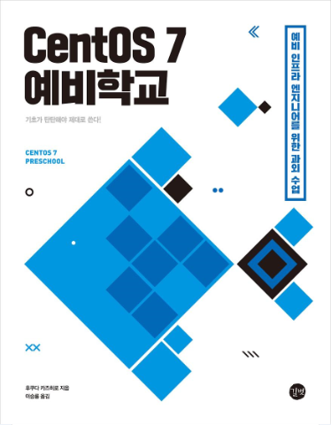

**CentOS 7 예비학교** :: [설정 파일 다운로드](#설정-파일-다운로드) | [정오표](#정오표)

# CentOS 7 예비학교

이 페이지는 <CentOS 7 예비학교> 에서 사용한 설정 파일 및 추가 정보를 독자에게 제공하기 위한 페이지입니다.
 
 ## 설정 파일 다운로드

  - [CentOS 7 예비학교 설정 예제 다운로드](https://github.com/gilbutITbook/006917/raw/master/download/centos7.tar.gz)

 ## 설정 파일 다운로드 (리눅스의 경우)

	wget https://github.com/gilbutITbook/006917/raw/master/download/centos7.tar.gz

 ## CentOS 다운로드 
  -  [**CentOS 7 (1708)** 다운로드 페이지](http://isoredirect.centos.org/centos/7/isos/x86_64/CentOS-7-x86_64-DVD-1708.iso)
  -  [**CentOS 7 (1708)** DVD ISO 다운로드](http://mirror.navercorp.com/centos/7/isos/x86_64/CentOS-7-x86_64-DVD-1708.iso)

 ## 참고 문서 및 링크
 - [**CentOS7** 공식 사이트](https://www.centos.org/)
 - [VirtualBox 다운로드 페이지](https://www.virtualbox.org/)
 - [FileZilla 다운로드 페이지](https://filezilla-project.org/download.php)

 ## 정오표

| 페이지 수 | 변경 전 | 변경 후 |
|:-------|-------:|:------:|
|   176 페이지 2번째 문단   |   [본문] 예를 들어, 추가한 하드 디스크를 **/mnt/sdc**로 마운트할 수 있게 /etc/fstab을 수정해봅시다.    |  [수정] 예를 들어, 추가한 하드 디스크를 **/mnt/sdc1**로 마운트할 수 있게 /etc/fstab을 수정해봅시다.    |

 (ver 20180513 )
 
 
 